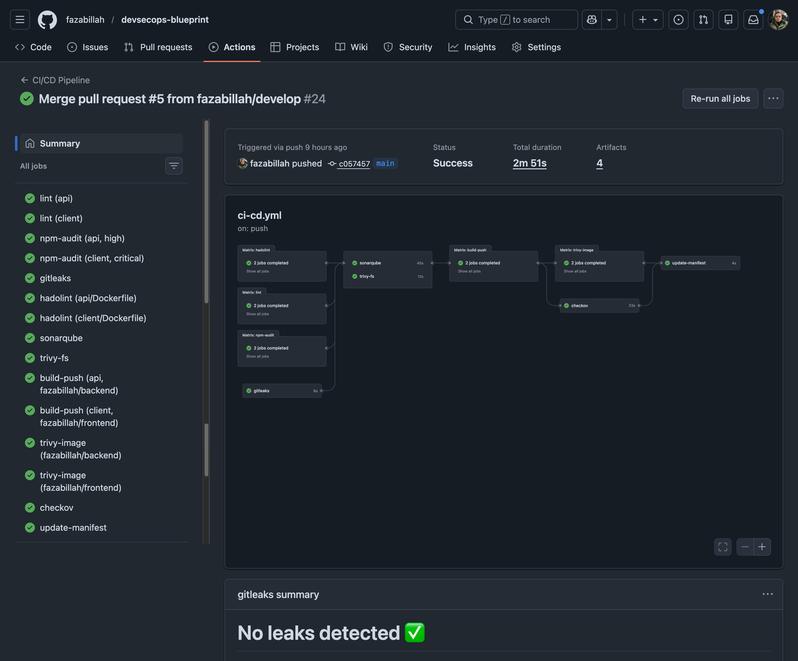
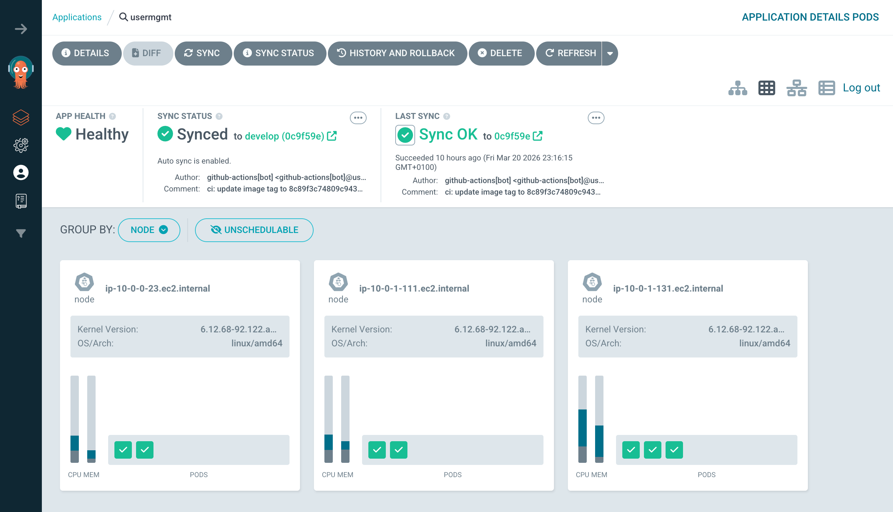
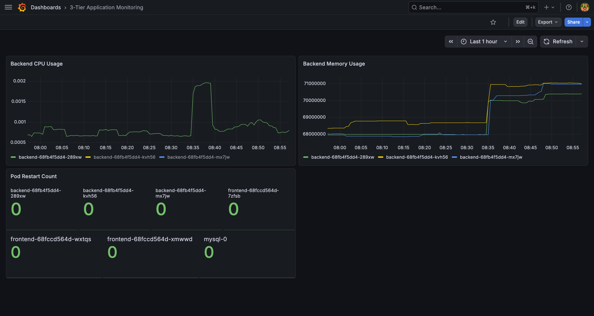

# DevSecOps Blueprint

This repo documents a security-gated CI/CD pipeline built on a 3-tier web app (React, Node.js/Express, MySQL). The pipeline blocks on six security checks before a Docker image is built.
- Deployment is GitOps via ArgoCD which CI writes a new image tag to Git.
- ArgoCD reconciles the cluster.
- Infrastructure is Terraform on EKS.

Every architectural decision is documented in an 8-part markdown file in `docs/`.

Built as a portfolio project. 
- The application is a vehicle.
- The pipeline, the Helm chart, the security gate ordering, and the documented tradeoffs are the deliverable.

---

## Table of Contents

- [Status](#status)
- [Architecture](#architecture)
  - [Application tiers](#application-tiers)
  - [Infrastructure stack](#infrastructure-stack)
- [Quick Start](#quick-start)
- [Pipeline](#pipeline)
- [Design Decisions](#design-decisions)
  - [Why security gates belong in CI, not after it](#why-security-gates-belong-in-ci-not-after-it-)
  - [Pipeline gate ordering: fail fast, fail cheap](#pipeline-gate-ordering-fail-fast-fail-cheap)
  - [GitOps over push-based CD](#gitops-over-push-based-cd)
  - [Helm over raw manifests](#helm-over-raw-manifests)
  - [Why these specific security tools](#why-these-specific-security-tools)
  - [EKS + Terraform over a managed PaaS](#eks--terraform-over-a-managed-paas)
  - [MySQL StatefulSet over RDS](#mysql-statefulset-over-rds)
- [Security Coverage](#security-coverage)
- [CI/CD Configuration](#cicd-configuration)
- [Tradeoffs and Skips](#tradeoffs-and-skips)
- [Repository Layout](#repository-layout)
- [What this pipeline does uniquely](#what-this-pipeline-does-uniquely)
- [Troubleshoot Log](#troubleshoot-log)
- [Production Improvements](#production-improvements)
- [Documentation Series](#documentation-series)

---

## Status

- The EKS cluster is decommissioned.
- The application runs locally via Docker Compose.
- The full Kubernetes deployment is reproducible from the [docs/03-kubernetes-deployment.md](docs/03-kubernetes-deployment.md). 
- CI pipeline screenshots below show all jobs passing.

---

## Architecture

### Application tiers

```
[Ingress (NGINX)] ← TLS via cert-manager (Let's Encrypt)
        │
        │  NetworkPolicy: allow only from ingress
        ↓
[React SPA — nginx:alpine]                React 19 (CRA)
        │
        │  NetworkPolicy: allow only from frontend
        ↓
[Node.js 22 / Express — node:22-alpine]  ← JWT auth, bcrypt passwords
        │
        │  NetworkPolicy: allow only from backend
        ↓
[MySQL 8 — StatefulSet, EBS-backed PVC]
```

Security contexts on all pods: non-root user (UID 1000), drop ALL capabilities, seccomp RuntimeDefault.

### Infrastructure stack

1. Local dev runs via Docker Compose (three containers, bridge network). 
2. The Kubernetes target is EKS provisioned with Terraform that covers VPC layout, the OIDC provider for IRSA, and the EBS CSI driver for persistent volumes. 
3. The app is packaged as a Helm chart (`charts/usermgmt/`, 9 templates). 
4. ArgoCD manages deployment via pull-based GitOps with Self Heal and Prune enabled, so cluster state always reflects the Git repo.

---

## Quick Start

**Prerequisites:** Docker Desktop (or Docker Engine + Compose plugin). Node.js 22 LTS is only needed if running outside Docker.

```bash
git clone https://github.com/fazabillah/devsecops-blueprint.git
cd devsecops-blueprint
docker-compose up
```

**Verify:**
- Frontend: http://localhost:3000 — login page
- Backend health: http://localhost:5001/api/health — `{"status":"ok"}`
- Default admin: `admin@example.com` / `admin123`

For the full Kubernetes deployment, start at [docs/03-kubernetes-deployment.md](docs/03-kubernetes-deployment.md). 

An AWS account and a configured EKS cluster are required.

---

## Pipeline

```
git push
    │
    ├─[parallel]─── ESLint (api + client)
    │                npm audit (api: HIGH gate, client: CRITICAL gate)
    │                GitLeaks (full history scan)
    │                Hadolint (Dockerfile lint)
    │
    ├─[parallel]─── SonarCloud (SAST)
    │                Trivy FS (filesystem CVE scan, no node_modules)
    │
    ├──────────────── Docker build + push to DockerHub
    │                  (image tag = short commit SHA)
    │
    ├─[parallel]─── Trivy image scan
    │                Checkov (Helm templates + Terraform)
    │
    └──────────────── Update charts/usermgmt/values.yaml with new image tag
                         │
                         └── ArgoCD detects diff → helm upgrade → pods roll
```





---

## Design Decisions

Each decision below names the alternative that was rejected and explains the tradeoff.

### Why security gates belong in CI, not after it ?

Most engineering teams have CI/CD. Fewer have security gates wired into it. The result is that vulnerabilities:
- leaked secrets
- CVEs in npm packages
- misconfigured Kubernetes manifests that get discovered in production instead of in development. 

This pipeline addresses that specific gap.

The relevant comparison is a team with CI/CD but without automated security scanning, and it's measurable using DORA's four key metrics:

| Metric | Without security gates | With this pipeline |
|---|---|---|
| Deployment frequency | Throttled by manual security review cycles | Every push to main — automated gates replace manual review |
| Lead time for changes | Days to weeks (waiting for security sign-off) | Minutes to hours (gates run in CI, not post-deployment) |
| Change failure rate | High — security issues caught in production | Lower — 6 automated gates catch issues before the image is built |
| MTTR | Hours to days (production incident response) | Shorter — fewer security incidents reach production |

Security-specific metrics:

- **Vulnerability escape rate**: without CI scanning, CVEs in dependencies and container images reach production undetected. With Trivy FS + image scan + npm audit, the escape rate for known HIGH/CRITICAL CVEs approaches zero.
- **Cost-to-fix differential**: NIST research puts the cost to fix a vulnerability in development at $80–100 and in production at $7,600–14,000. Catching a HIGH npm CVE in a 2-minute CI run costs minutes. Catching it after a breach does not.
- **Audit trail**: every pipeline run generates scan artifacts (Trivy JSON, Checkov results, GitLeaks output). This is directly usable as compliance evidence for SOC 2 / ISO 27001 controls.

### Pipeline gate ordering: fail fast, fail cheap

- Security gates run before Docker build for a reason. ESLint, npm audit, GitLeaks, and Hadolint are fast (seconds), run on raw source, and cost nothing. 
- If any of them fail, the pipeline stops before the Docker daemon is even invoked. 
- SonarCloud and Trivy FS run in parallel in the second stage and both need source code, not an image. 
- Docker build only runs if all six of those pass.

This ordering means a secret leak or a critical npm CVE kills the pipeline in under 2 minutes instead of waiting for a 5-minute image build first.

### GitOps over push-based CD

The alternative was running `kubectl apply` or `helm upgrade` directly in CI after the image push. 

That works but creates two sources of truth: 
1. what's in Git, and
2. what's actually deployed. 

They drift. 

ArgoCD's pull model inverts this that CI's only job is to update a value in Git. ArgoCD detects the diff and reconciles. If someone manually changes a deployment (misconfiguration, emergency patch, accidental `kubectl edit`), ArgoCD reverts it on the next sync. Production state is always what Git says it is, not whatever the last CI run pushed.

### Helm over raw manifests

With raw manifests, the backend and frontend Deployments are nearly identical YAML duplicated across files. Helm parameterizes the differences (image name, replica count, resource limits, service port) into `values.yaml`. The bigger reason: ArgoCD + Helm enables the GitOps loop cleanly. CI updates one field in `values.yaml` (the image tag), ArgoCD detects a Git diff, runs `helm upgrade`. No custom scripting, no drift between what was applied and what's in source.

### Why these specific security tools

Each tool covers a different attack surface with no meaningful overlap:

- **GitLeaks**: catches secrets before they reach an image layer or a cluster. Scans full history, not just the latest commit.
- **npm audit**: dependency CVEs (SCA). Separate thresholds for api (HIGH) and client (CRITICAL) reflect different exposure: the backend holds database credentials, the frontend runs in a browser with no direct data access.
- **Hadolint**: Dockerfile-specific lint. Catches missing `USER` directives, unpinned base images, and `RUN` instruction antipatterns that Trivy won't surface.
- **SonarCloud**: SAST on application logic. Finds injection paths and hardcoded secrets in code (not git history) that static linters miss.
- **Trivy FS**: CVE scan on the filesystem before build. Catches OS-level package vulnerabilities before they get baked into the image.
- **Trivy image scan**: post-build CVE scan on the final pushed image. Catches anything introduced by the Docker build process itself.
- **Checkov**: IaC misconfigurations in Helm and Terraform. Finds missing `securityContext`, overly permissive RBAC, and unset resource limits.

### EKS + Terraform over a managed PaaS

The goal was to demonstrate infrastructure provisioning, not just application deployment. 

EKS via Terraform requires explicit decisions about VPC design (subnets, CIDR blocks), IAM (OIDC provider, EBS CSI driver permissions), and cluster configuration. A managed PaaS abstracts all of this. Terraform makes the infra reproducible and reviewable and this is the same reason the app deployment uses Helm and ArgoCD instead of manual kubectl.

### MySQL StatefulSet over RDS

RDS would be the right call in production (see Production Improvements). 

MySQL as a StatefulSet was a deliberate learning choice: it demonstrates Kubernetes storage primitives (PersistentVolumeClaim, StorageClass, EBS CSI driver) and StatefulSet semantics (stable network identity, ordered pod management) that a managed database hides. 

The tradeoff is that this is not a production data durability recommendation.

---

## Security Coverage

| Phase | Tool | What it gates on |
|---|---|---|
| Source code | ESLint + SonarCloud | Lint violations, code smells, potential injection paths |
| Dependencies | npm audit | CVEs in npm packages (HIGH for api, CRITICAL for client) |
| Secrets | GitLeaks | Credentials and tokens in commits (full history on every push) |
| Dockerfile | Hadolint | Base image pinning, RUN chaining, USER directive |
| Filesystem | Trivy FS | CVE scan before the image is built |
| Container image | Trivy image scan | Post-build CVE scan on the final pushed image |
| IaC | Checkov (Helm + Terraform) | Missing securityContexts, misconfigurations in manifests |
| Runtime | NetworkPolicies (3 policies) | Pod-to-pod traffic restricted to least privilege |
| Runtime | securityContext on all pods | Non-root user (UID 1000), drop ALL capabilities, no privilege escalation |

---

## CI/CD Configuration

To run the pipeline on a fork, configure these secrets in GitHub Actions → Settings → Secrets:

| Secret | Purpose |
|---|---|
| `DOCKERHUB_USERNAME` | DockerHub login for image push |
| `DOCKERHUB_TOKEN` | DockerHub access token (not your password) |
| `SONAR_TOKEN` | SonarCloud analysis token |
| `GH_PAT` | Personal access token — needs `repo` scope to commit the image tag update back to the repository |

`GITHUB_TOKEN` is provided automatically by GitHub Actions. No setup required.

The pipeline triggers on push to `main` and `develop`, and on pull requests targeting `main`.

---

## Tradeoffs and Skips

**Checkov skips** are inline with justification comments and not blanket ignores. 
- Four Kubernetes checks are skipped (image digest pinning, which conflicts with tag-based GitOps;
- UID enforcement, which is handled at the image level;
- env var secrets, which MySQL init requires;
- readOnlyRootFilesystem, which MySQL and nginx both need writable paths for). 

Each skip has a comment explaining the tradeoff.

**Trivy image scan** runs with `exit-code: 0`, a deliberate soft gate. 
- In a solo portfolio project without a remediation team, a hard block on image scan would stall the pipeline indefinitely. The scan still runs and the output is logged. This is the same tradeoff production teams make when bootstrapping security gates.

---

## Repository Layout

```
.
├── api/                                Node.js/Express backend
├── client/                             React frontend
├── mysql-init/                         init.sql — runs on first MySQL container start
├── charts/
│   └── usermgmt/                       Helm chart (9 templates)
│       ├── values.yaml                 ArgoCD watches this file; image tag update here triggers helm upgrade
│       └── templates/
│           ├── networkpolicies.yaml    3 least-privilege pod-to-pod policies
│           ├── clusterissuer.yaml      Let's Encrypt ACME issuer
│           ├── ingress.yaml            TLS termination
│           ├── mysql.yaml              StatefulSet + Secret + ConfigMap
│           ├── backend.yaml            Deployment (3 replicas) + Service
│           └── frontend.yaml           Deployment (3 replicas) + Service
├── eks/                                Terraform for EKS cluster — provisioned separately, not wired into CI
├── monitoring/                         kube-prometheus-stack Helm values (Prometheus + Grafana)
├── .github/workflows/                  ci-cd.yml — 10-job pipeline; final job writes new image SHA to values.yaml
└── docs/                               8-part sequential documentaiton series
    ├── log-progress.md                 Session-by-session build log
    └── log-troubleshoot.md             Known failures and fixes
```

- `log-progress.md` is a session-by-session record of what was built and what broke.
- `log-troubleshoot.md` documents the actual failures and their fixes, including a MySQL CrashLoopBackOff caused by `allowPrivilegeEscalation: false` blocking the `setuid` call that MySQL 8 needs to drop root privileges.

---

## What this pipeline does uniquely?

This pipeline gates on **six security checks before the Docker image is built**, a secret leak or a critical CVE kills the pipeline before the Docker daemon is invoked.

**NetworkPolicies** aren't decorative. Three policies restrict pod-to-pod traffic: 
1. MySQL only accepts connections from the backend, 
2. the backend only accepts from the frontend, 
3. the frontend only accepts from the ingress controller. 

A compromised frontend pod cannot reach MySQL directly.

---

## Troubleshoot Log

Building this pipeline involved hitting real problems that documentation doesn't cover. The troubleshoot log records 21 failures from local Docker Compose through EKS production, each with the symptoms observed, the actual root cause, and how it was fixed.

A few entries that required more than a Google search:

| Problem | What made it non-obvious |
|---|---|
| MySQL `setuid: Operation not permitted` in CrashLoopBackOff | `allowPrivilegeEscalation: false` blocks the syscall at the kernel level regardless of what's in `capabilities.add`. Adding `SETUID` to capabilities alone wasn't enough — both had to change. |
| StatefulSet pod not picking up updated securityContext | `kubectl rollout restart` was issued; the pod kept crashing on the old spec. The StatefulSet template updated correctly but the running pod didn't recreate. Required a manual `kubectl delete pod mysql-0`. |
| Trivy FS blocking the pipeline on CVEs with `fixed-version: N/A` | No upstream fix exists for these CVEs — blocking on them produces noise with no remediation path. The resolution was treating Trivy FS as a soft gate (audit visibility) and keeping `npm audit` as the hard CVE gate, because it owns lockfile-precise dependency scanning. |
| Checkov reporting 20+ violations across Helm templates | The violations split into two categories: gaps actually fixable in the chart (security context, probes, resource limits) and image-level constraints (UID, filesystem mutability) that can't be addressed without changing the upstream image. Skipping the latter was correct; fixing the former was required. |
| Grafana dashboard 6417 showing N/A despite the datasource connecting | The `datasource` variable had `/$ds/` in its Instance name filter — a self-referencing value that resolves to nothing. Clearing it showed "Prometheus (1)" but all panels stayed N/A. The actual cause was that 6417 was last updated in 2018 and its metric names don't exist in current kube-prometheus-stack. |
| CI pipeline producing no runs on push to `main` | `on.push.branches` only listed `feature/*`. GitHub Actions doesn't error on a missing branch — the pipeline just never appears in the Actions tab. |

Full log (21 entries, grouped by area): [docs/log-troubleshoot.md](docs/log-troubleshoot.md)

---

## Production Improvements

What I would add or change if this were a real production system:

**Security**
- Trivy image scan is a soft gate here. In production: hard gate with a defined remediation SLA (CRITICAL within 24h, HIGH within 7 days) and a break-glass process for urgent deploys
- Image signing with Cosign and digest-pinned references. Checkov skips digest pinning here because tag-based GitOps requires mutable tags; production systems solve this with separate signing and verification steps
- External Secrets Operator pulling from AWS Secrets Manager instead of GitHub Actions secrets and raw env vars in pods
- Falco for runtime anomaly detection at the syscall level
- OPA/Gatekeeper admission controller to enforce Pod Security Standards across all namespaces

**Infrastructure**
- RDS Multi-AZ instead of a MySQL StatefulSet. Automated backups, managed patching, and Multi-AZ failover without manual intervention
- EKS API server on a private endpoint with cluster access through a VPN or bastion host, not the public endpoint
- IRSA (IAM Roles for Service Accounts) for fine-grained pod-level AWS permissions instead of node-level IAM
- PodDisruptionBudgets on all Deployments to prevent all replicas going down simultaneously during node drain
- HorizontalPodAutoscaler with Karpenter for node autoscaling under real load

**Pipeline**
- Path-filtered per-service pipelines. Currently every push rebuilds all images regardless of what changed
- Environment promotion: dev → staging (automated on merge) → production (manual approval gate)
- ArgoCD ApplicationSets for multi-environment management instead of a single Application pointing at one values file
- SBOM generation with Syft attached to each image push, stored alongside the image in the registry

**Operations**
- Prometheus alerting rules with Alertmanager routing to PagerDuty or Opsgenie. Currently dashboards only, no paging on failure
- Defined SLOs (99.9% API availability, p99 latency < 300ms) with error budget tracking in Grafana
- Velero for cluster state backup and documented DR runbooks
- Structured JSON logging with correlation IDs across all three tiers, shipped to a centralized log aggregator (Loki or OpenSearch)

---

## Documentation Series

The `docs/` directory is an 8-part sequential walkthrough of the full build from local Docker Compose to production monitoring on EKS. Each document covers one phase of the stack, includes the exact commands used, and ends with a self-check section so each step can be verified independently. 

The series is written to be reproducible. Anyone building a similar security-gated CI/CD pipeline on EKS can follow it as a reference or use it as a starting point for their own stack.     

| Part | File | Covers |
|---|---|---|
| 00 | [00-introduction.md](docs/00-introduction.md) | Architecture overview, full tech stack, Day 0–8 roadmap, prerequisites |
| 01 | [01-local-run.md](docs/01-local-run.md) | EC2 setup, NVM + Node 22, Docker Compose bring-up, smoke testing all 3 tiers |
| 02 | [02-multi-stage-dockerfile.md](docs/02-multi-stage-dockerfile.md) | Multi-stage builds to separate build/runtime, image size reduction, non-root user, nginx SPA routing |
| 03 | [03-kubernetes-deployment.md](docs/03-kubernetes-deployment.md) | Terraform EKS provisioning (VPC, OIDC, EBS CSI), manual kubectl deploy to `prod` namespace |
| 04 | [04-helm-charts.md](docs/04-helm-charts.md) | Packaging all 3 tiers into 9 Helm templates, values.yaml parameterization, `helm upgrade` workflow |
| 05 | [05-github-actions-ci-pipeline.md](docs/05-github-actions-ci-pipeline.md) | 10-job pipeline with gate logic, job dependency graph, GitLeaks + Trivy + Checkov + SonarCloud wiring |
| 06 | [06-argocd-gitops.md](docs/06-argocd-gitops.md) | Pull-based CD setup, Self Heal + Prune config, end-to-end GitOps loop from CI commit to pod rollout |
| 07 | [07-production-deployment.md](docs/07-production-deployment.md) | cert-manager + Let's Encrypt TLS, ingress config, DNS, continuous delivery vs continuous deployment |
| 08 | [08-monitoring-setup.md](docs/08-monitoring-setup.md) | kube-prometheus-stack install, Grafana dashboard import, custom 3-tier dashboard with CPU/memory/restart metrics |



